I was inspired by [this post](https://tiramisu.bearblog.dev/2021-photos/) to share some of my favourite photos from 2022.

# 🇪🇸 Tenerife, Spain

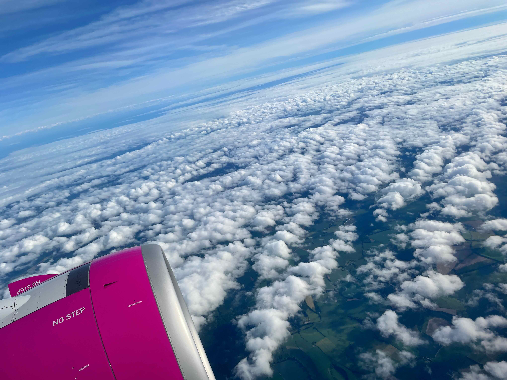

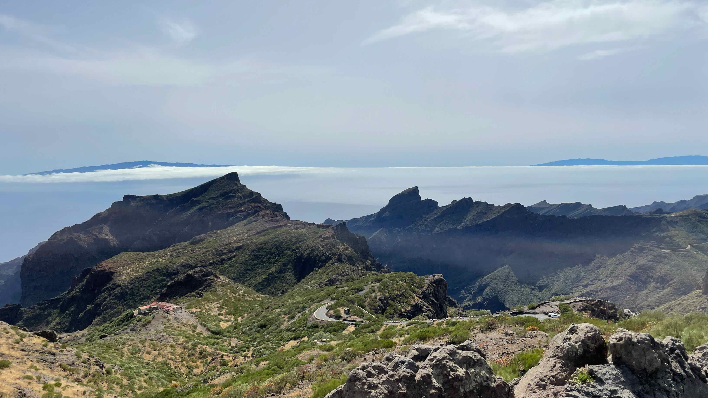

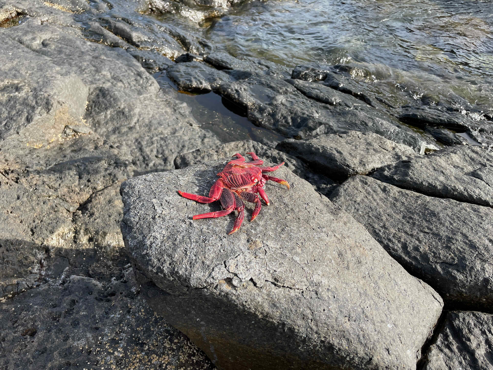

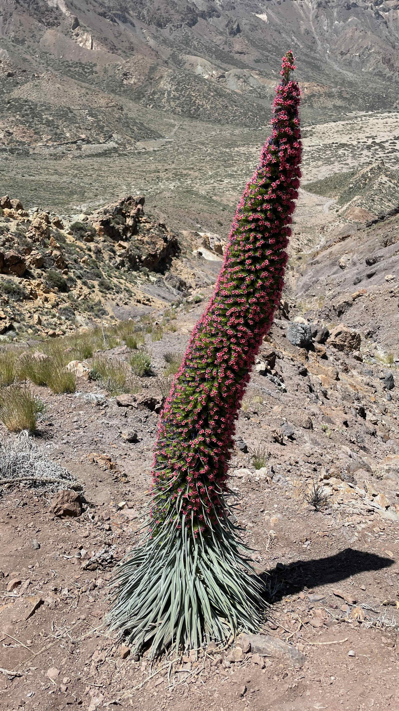
_This strange looking plant is a [Echium wildpretii](../assets/https://en.wikipedia.org/wiki/Echium_wildpretii)._

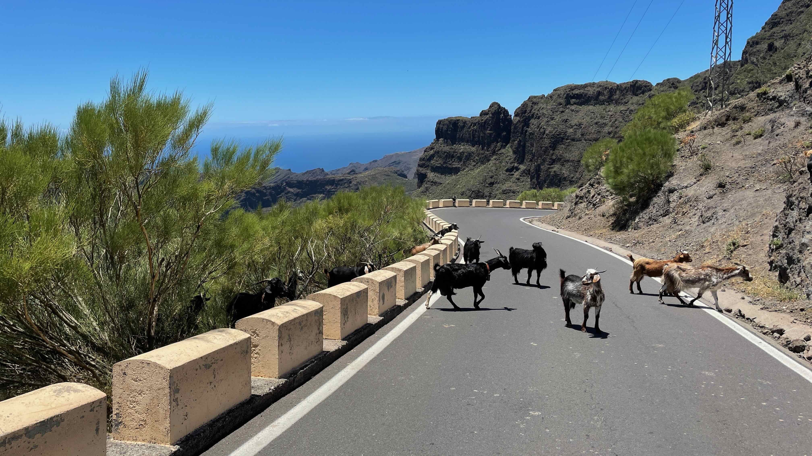

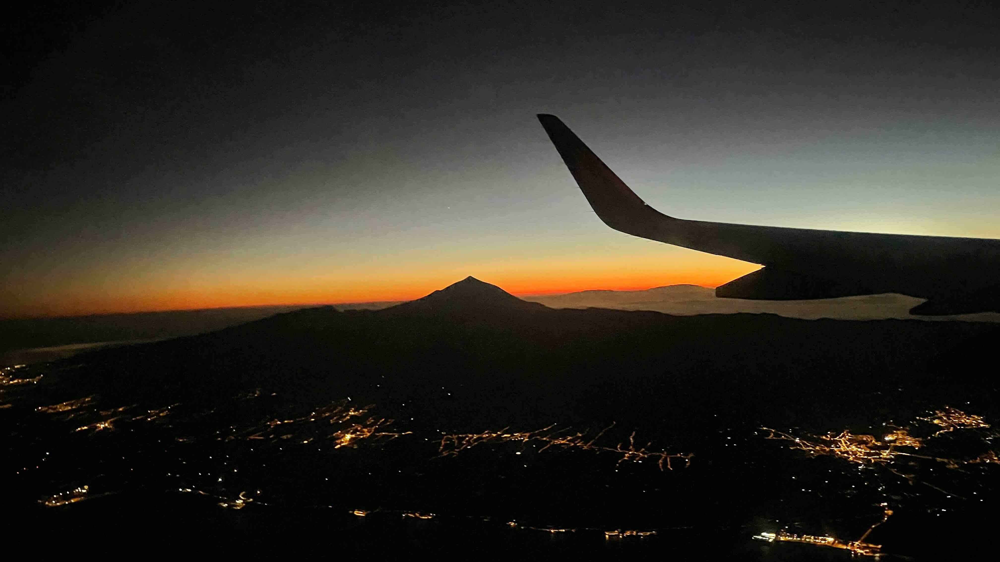

# 🇨🇭 Zurich, Switzerland

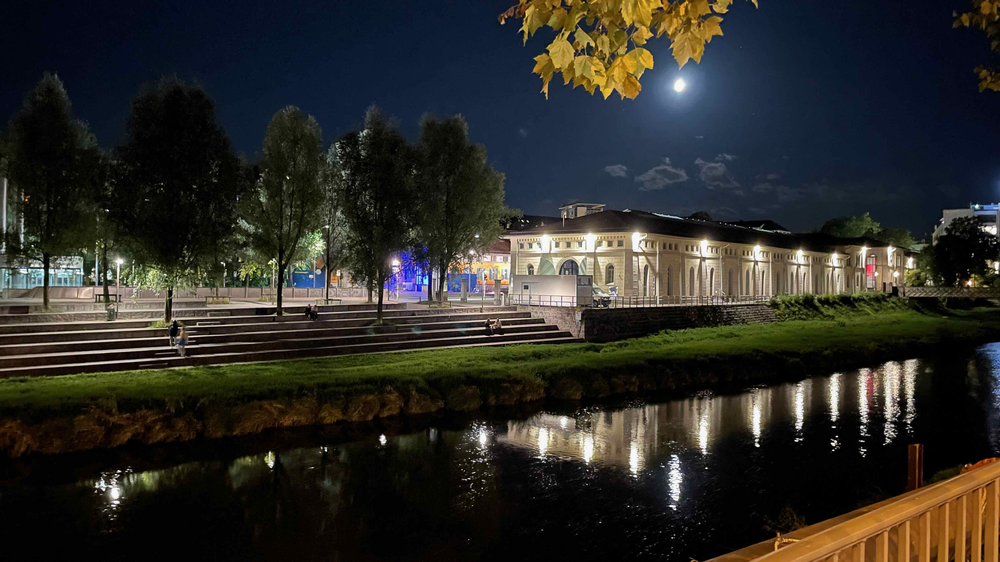

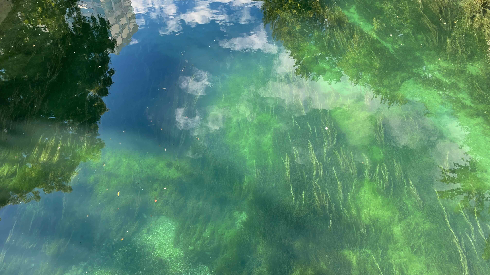

# Misc

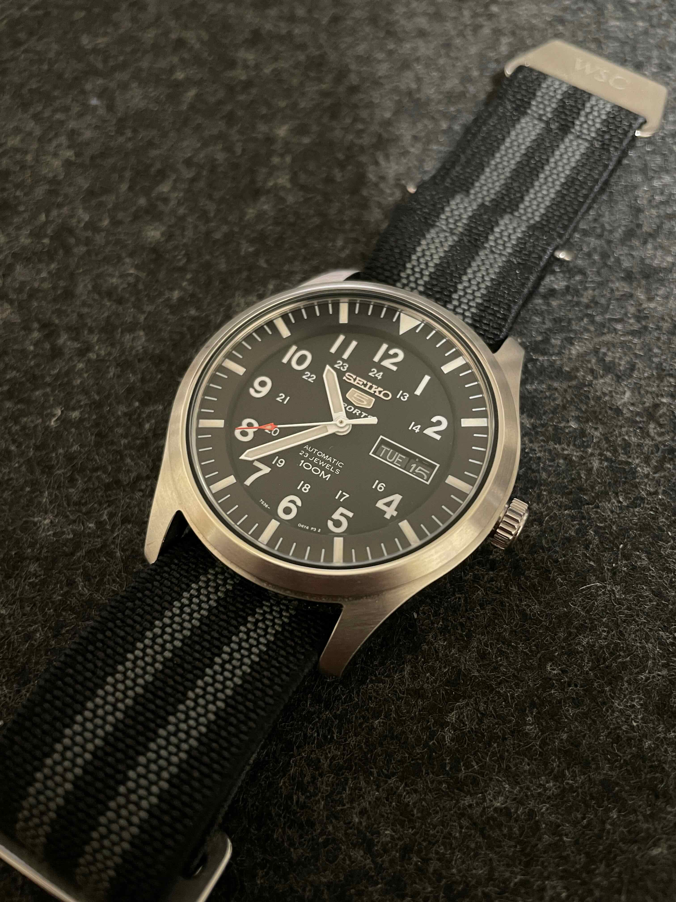

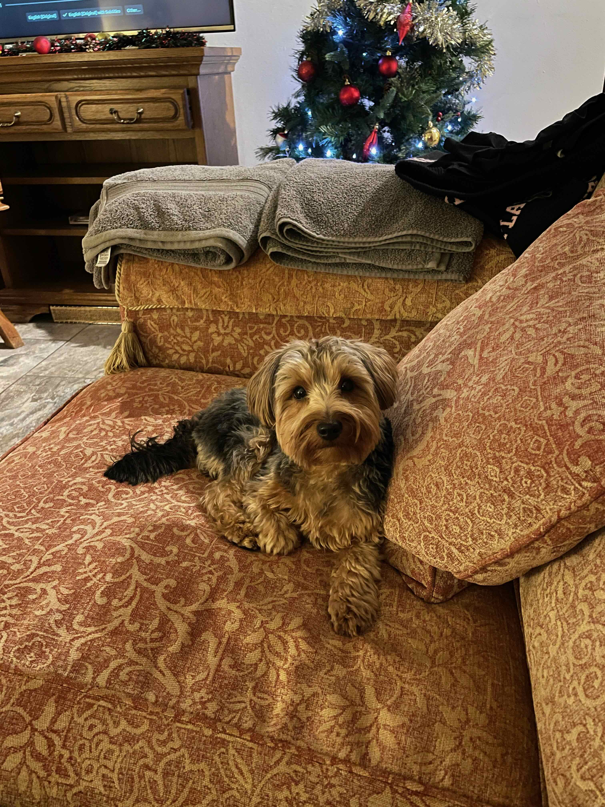

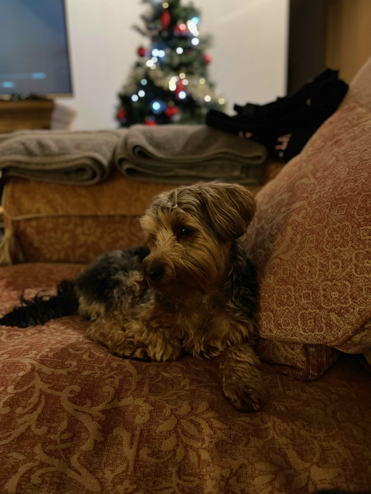
