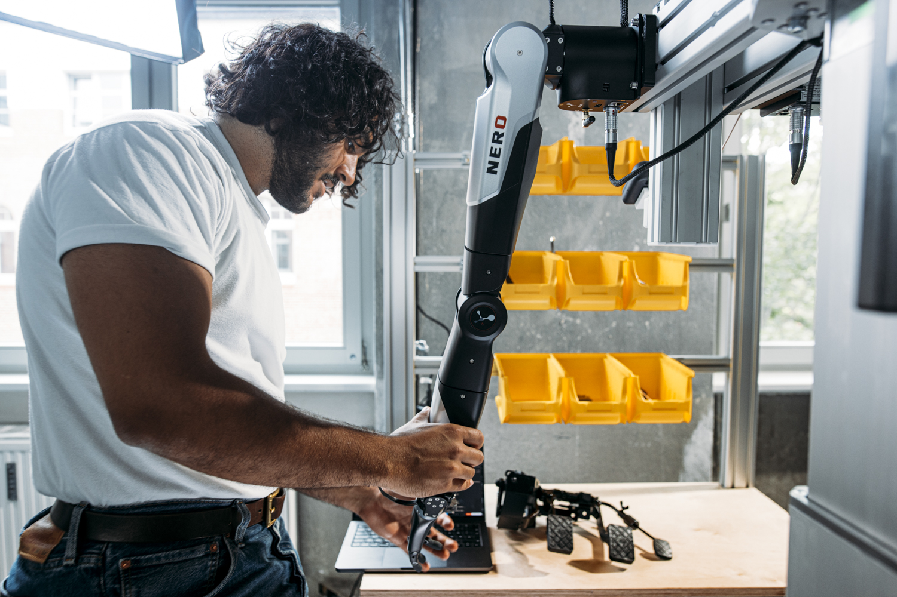
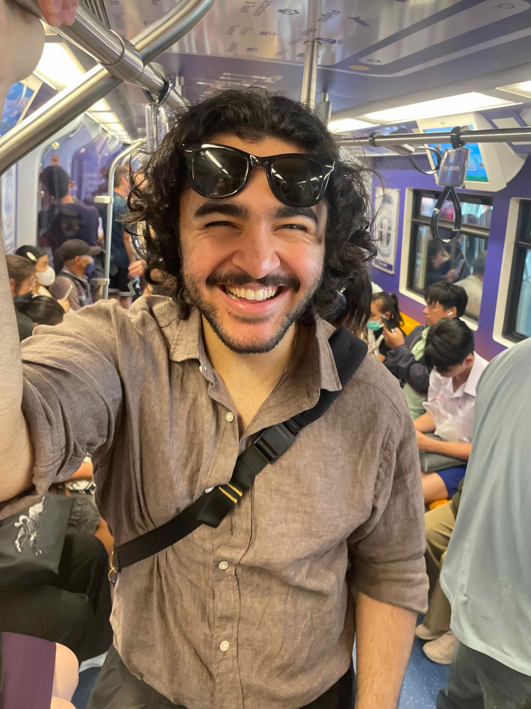
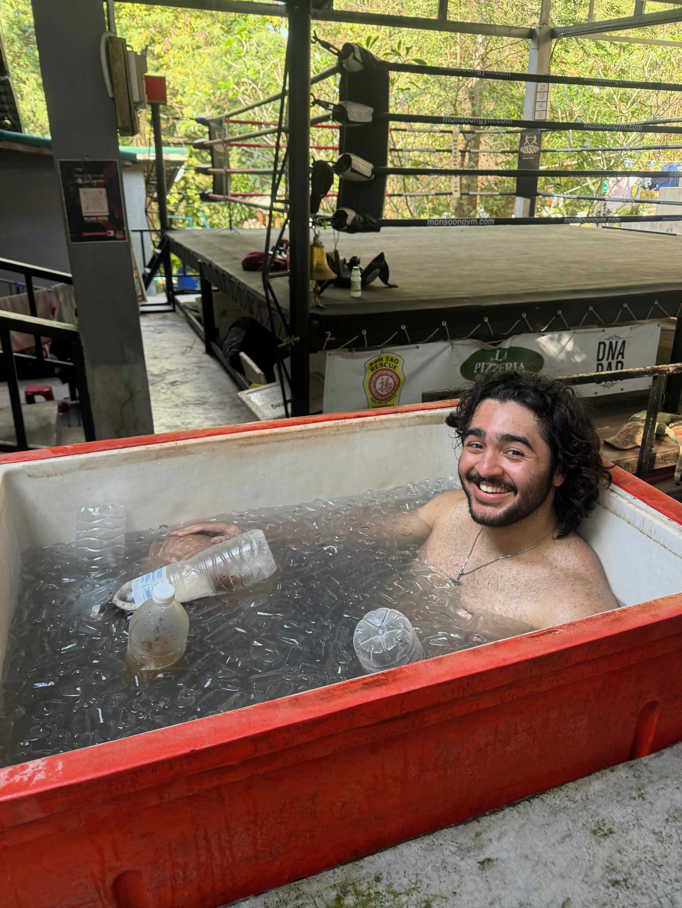
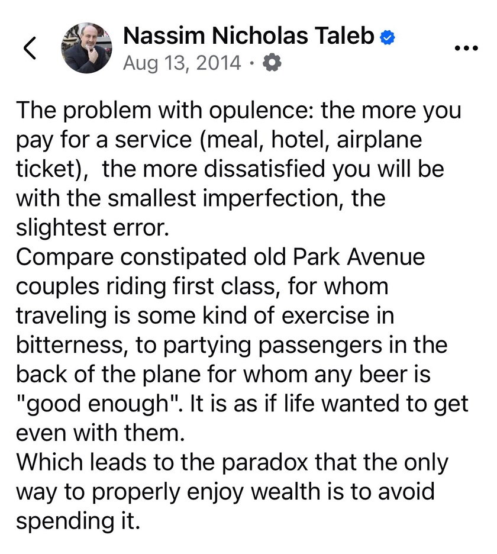
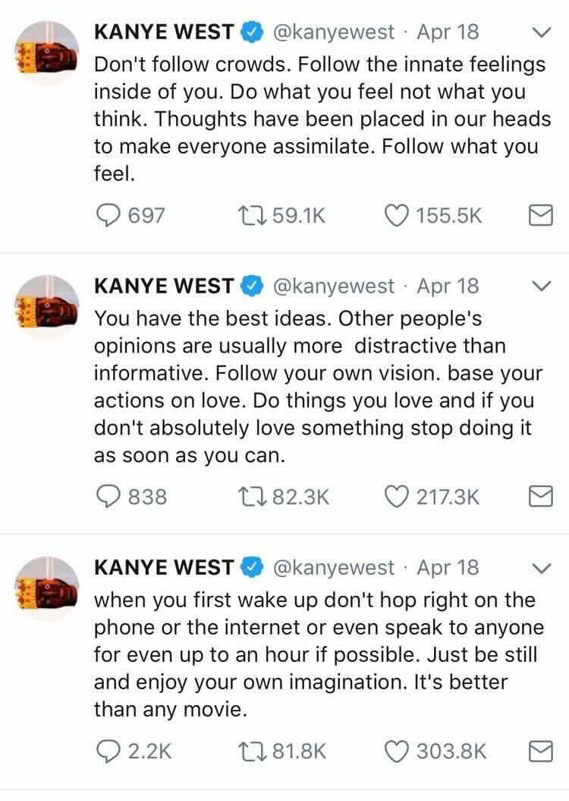

Even though I haven't posted in a while, I still enjoy keeping up [this](https://parsam.io/20/) [yearly](https://parsam.io/21) [tradition](https://parsam.io/22) of writing a post on my birthday.

This time I'll keep it simple and share a few things I did in the past year:

**[Left Tesla](https://parsam.io/yaak) to work on robotics at a [startup](https://yaak.ai)**
- I've been learning daily. Reminds me of my first few months at Google where everything was so new to me. I'm glad I made this pivot

**Travelled more than usual, most of it this year**
- went to places I've been before like Amsterdam, Munich (usually quarterly), London (also < ~quarterly), Copenhagen and Poland
- solo travelled Thailand (wow how original). It was the furthest I travelled, and I had an amazing time visiting Bangkok (I think I overstayed by a day), [Koh Tao](https://www.google.com/search?q=koh+tao) (my favourite by far) and [Koh Samui](https://www.google.com/search?q=koh+samui) (my least favourite by a mile)
	- met a [twitter friend](https://x.com/eftegarie) in Bangkok which was cool
	- Koh Samui was too developed for my tastes
	- but Koh Tao struck the right balance for me, I even stayed for 2 extra days and dropped visiting Koh Phangan
	- I bumped into 2 people I know from London (colleague from Google) and Berlin (colleague from Tesla) on Koh Tao. The chances are ridiculous
	- drivers in Thailand drive like they disabled those assist lines in racing games. In the West they drive too safely
- visited Barcelona for the first time. I liked it and met so many interesting people
- Italy a few times: Rimini, Bologna, [Lake Como](https://www.google.com/search?q=lake+como) and Colico

On the Bangkok metro:

Taking an ice bath in Koh Tao after [Muay Thai](https://maps.app.goo.gl/LnBDFWigXYYmiVRT6):

**Misc**
- competed in my first [powerlifting meet](https://parsam.io/2025-photos/#berlin-strength-meet)
- appreciating fiction a lot more
- dined at a Michelin starred restaurant for the first time. Not for me, I prefer popping into Haji's Persian grill or Abi's Turkish Ocakbaşı. Reminds me of this Taleb quote: 

As I get older I'm starting to appreciate having a simpler life. Yeah it sounds cliche but people often subscribe themselves to too many things, and they could never focus on few. I truly admire the likes of the late Charlie Munger, living below their means.

But then again I'm the type of guy who's constantly changing. Tomorrow I might want to live like Future (probably not).

Anyways I'll leave you with some thoughts from the goat:

