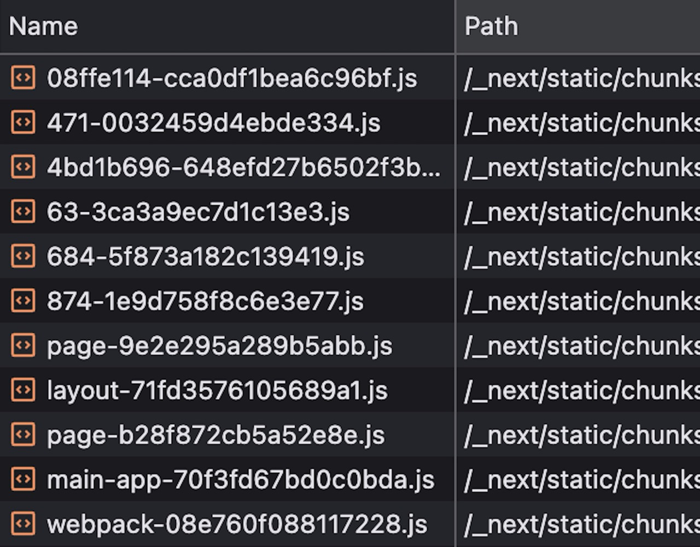
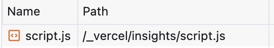

I recently migrated this site from [Next.js](https://nextjs.org/) to [Astro](https://astro.build), and I wish I did it earlier.

As much as I love Next, it was just overkill for a static blog like mine. I shouldn't be shipping all of this js junk to render some text and images.



I'm not exactly an expert with Next to know why all of this needed, but I don't think I need to be. If I specify my pages are static, then it should be as it says on the tin.

Now after switching to Astro, the only injected script I ship is [Vercel Web Analytics](https://vercel.com/docs/analytics).


Initially I also attempted to try out [Cloudflare Pages](https://pages.cloudflare.com/), but went back to [Vercel](https://vercel.com/) for convenience sake. I think Vercel has done a great job on their platform's UI.

The [migration](https://docs.astro.build/en/guides/migrate-to-astro/from-nextjs/) process was smooth for a relatively simple site like [mine](https://github.com/pzrsa/parsam.io/pull/10).
# Content collections
Using [content collections](https://docs.astro.build/en/guides/content-collections/) meant I no longer have to manually write code to retrieve and process my markdown posts.

This is all I have to do to define a collection of posts and retrieve them.
```ts
// content.config.ts
const blog = defineCollection({
  loader: glob({ pattern: "**/*.md", base: "./src/data/blog" }),
  schema: z.object({
    date: z.coerce.date(),
    title: z.string(),
    author: z.string().optional(),
    description: z.string().optional(),
  }),
});

// utils.ts
export const getBlogPosts = async () => {
  const posts = await getCollection("blog");
  posts.sort((a, b) => b.data.date.getTime() - a.data.date.getTime());
  return posts;
};
```

Much better than doing all of this. Yeah I know my code is not elegant.
```ts
import fs from "fs";
import matter from "gray-matter";
import path from "path";
import { PostWithContent, PostWithContentHtml } from "./types";
import html from "remark-html";
import { remark } from "remark";

const postsDirectory = path.join(process.cwd(), "posts");

export const getSortedPostData = () => {
  const fileNames = fs.readdirSync(postsDirectory);
  const allPostsData = fileNames.map((fileName) => {
    // Remove ".md" from file name to get id
    const id = fileName.replace(/\.md$/, "");

    // Read markdown file as string
    const fullPath = path.join(postsDirectory, fileName);
    const fileContents = fs.readFileSync(fullPath, "utf8");

    // Use gray-matter to parse the post's metadata section
    const matterResult = matter(fileContents);

    return {
      id,
      ...matterResult.data,
    };
  });

  // Sort posts by date
  return allPostsData
    .filter(({ draft }: any) => !draft)
    .sort(({ date: a }: any, { date: b }: any) => {
      if (a < b) {
        return 1;
      } else if (a > b) {
        return -1;
      } else {
        return 0;
      }
    });
};

export const getAllPostIds = () => {
  const fileNames = fs.readdirSync(postsDirectory);
  return fileNames.map((fileName) => ({ id: fileName.replace(/\.md$/, "") }));
};

export const getPost = (id: string) => {
  const fullPath = path.join(postsDirectory, `${id}.md`);
  const fileContents = fs.readFileSync(fullPath, "utf8");

  const matterResult = matter(fileContents);

  const content = matterResult.content;

  return {
    id,
    content,
    ...matterResult.data,
  } as PostWithContent;
};

export const getPostWithHtml = async (id: string) => {
  const fullPath = path.join(postsDirectory, `${id}.md`);
  const fileContents = fs.readFileSync(fullPath, "utf8");

  const matterResult = matter(fileContents);

  // Use remark to convert markdown into HTML string
  const processedHtml = await remark().use(html).process(matterResult.content);
  const contentHtml = processedHtml.toString();

  return {
    id,
    contentHtml,
    ...matterResult.data,
  } as PostWithContentHtml;
};
```

# API Endpoints
I like to display the song I'm currently playing using the [Spotify API](https://developer.spotify.com/documentation/web-api/reference/get-the-users-currently-playing-track). Thanks to server [endpoints](https://docs.astro.build/en/guides/endpoints/#server-endpoints-api-routes) and [islands](https://docs.astro.build/en/concepts/islands/#server-islands) I didn't have to sacrifice this. It works even better than before, the island is server side rendered, so no JS calls.


# Images
Images stored in `src/` are optimised, but they cannot be accessed through a public link. On the other hand, ones stored in `public/`, i.e the ones used in my posts, are [not optimised](https://docs.astro.build/en/guides/images/#where-to-store-images), which is a shame.

Since I use RSS feeds and believe in them whole heartedly, I will stick with storing them in `public/`. It's fine, I try to display relatively optimised images, but it's something I'm missing out on which is a bit annoying.

P.S, if you were subscribed to my old RSS feed, `parsam.io/feed.atom`, please update to using `parsam.io/rss.xml` ([link](https://parsam.io/rss.xml))
# Dependencies
I love how much I've cut down on dependencies during the migration. It was a much needed cleanup.

Anyways, at the end of the day, these are minuscule improvements. What matters is the content I produce, but I also think having a fast website should be a right for visitors.
