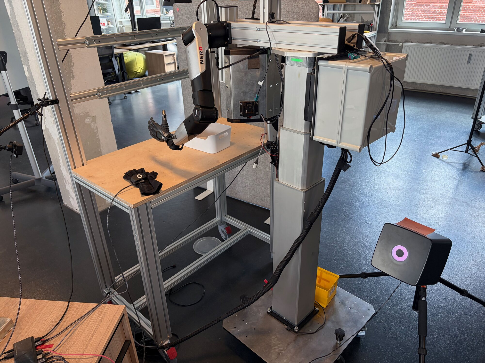
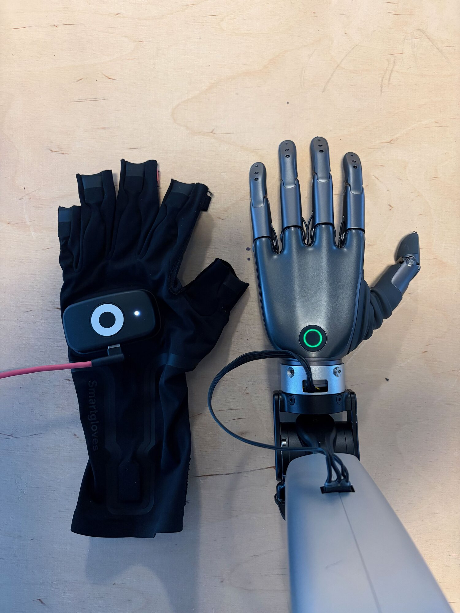
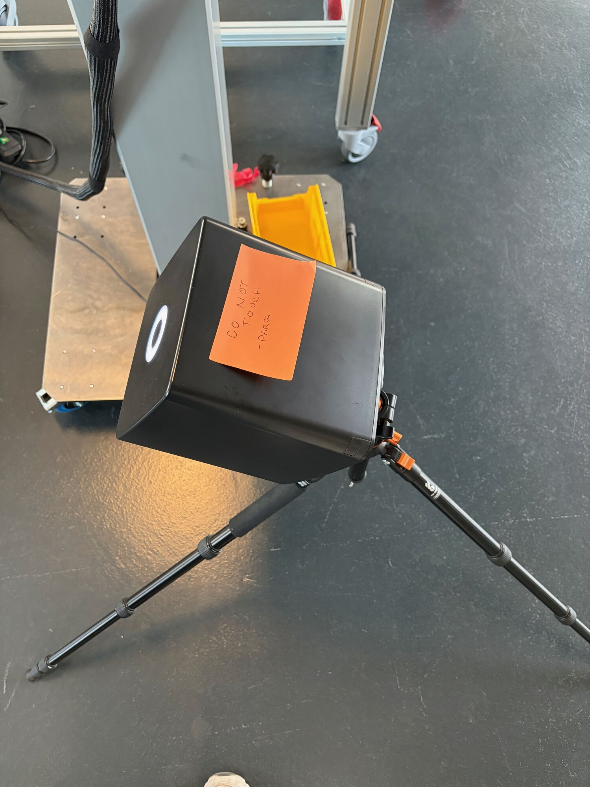
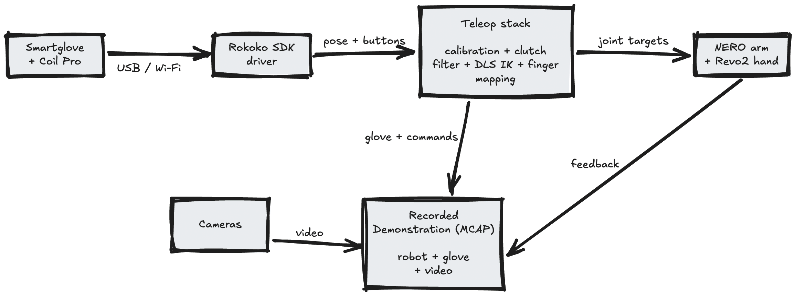

Recently I built a teleoperation stack controlled by motion-capture (mocap) gloves, and used it to collect roughly an hour of robot demonstrations.

It works with the gloves measuring the movement of my fingers and wrist, while an electromagnetic tracker gives my hand an absolute position in space. Together they let me move a robot arm by moving my own arm, and it feels like magic.

<video controls autoplay muted loop playsinline preload="metadata" data-scroll-play>
 <source src="/blog/teleop-hero.mp4" type="video/mp4"/>
</video>

This kind of setup is often used by game studios for capturing human motion, but surprisingly it's found a place in robotics research.

A lot of robot data is collected through teleoperation. A common setup involves two robot arms: a human moves the leader, while a follower copies its joint angles. This approach is ideal because everything being recorded is already a robot action, but it requires duplicate hardware and an operator who knows how to use it, making it fairly slow and expensive.

Some of our customers have people working in warehouses assembling products, which is work we eventually want our robots to do. As you could imagine, teaching every worker to teleoperate a robot would be pretty hard. But having them wear mocap gloves while doing work as usual seems like a much more scalable way to collect demonstrations.

The problem is that human motion doesn't magically become robot data. Humans and ~~clankers~~ robots have different proportions, joints, and limits, so the movement somehow has to be mapped from us to them. Although human demonstrations could eventually provide more data, [Physical Intelligence's recent work](https://www.pi.website/research/human_to_robot) suggests that models become better at learning from human data after pretraining on sufficiently diverse robot data.

So before trying to collect demonstrations without a robot, I used the gloves to control one directly. I essentially killed two birds with one stone:
1. it gives me native robot demonstrations
2. it tests whether the mapping from human to robot works on physical hardware

In this post, I'll be sharing how I made it usable, from choosing the gloves, tracking them in space, mapping their motion onto a robot arm, and keeping it stable long enough to collect data.

# The Setup

It consists of:
- 2x 7-DOF [AgileX Nero arms](https://global.agilex.ai/products/nero)
- 2x 6-DOF [Brainco Revo2 Touch hands](https://www.brainco-hz.com/docs/revolimb-hand/en/revo2/parameters.html)
- 2x [Rokoko Smartgloves II](https://www.rokoko.com/products/smartgloves-ii)
- 1x [Rokoko Coil Pro](https://www.rokoko.com/products/coil-pro)

Hypothetically, the setup is bimanual, meaning it controls two arms. But the work was done on the left arm because the right hand has a faulty thumb motor. I was pretty disappointed since each hand costs a couple grand, so I expected better quality hardware. 

Our electrical engineers mounted the arms on a custom stand, which makes them hang from the sides like a human. 

## Picking the gloves

The first gloves I tried were the [Manus Metagloves Pro](https://www.manus-meta.com/products/metagloves-pro). I shared some notes with the team after that one-week trial. Keep in mind these are from mid April, so things might have changed since then:

- The fingertips are quite obtrusive. They gave my fingertips a weird feeling initially, though that went away. I could barely type on a keyboard with them, which would be annoying for operators
- The calibration software is Windows only, and the SDK only runs on x86, so our Jetson couldn't connect to them directly
- The EMF fingertip sensors jumped near metal, and some of the workbenches we use are metal
- You need an HTC Vive tracker mounted on them for absolute position (they provide a mount)
- Complex C++ SDK stack
- Expensive

So we returned them, and I suggested we try the [Rokoko Smartgloves](https://www.rokoko.com/products/smartgloves-coil-pro-precision-finger-capture) instead. Mostly because that's what [DexCap](https://dex-cap.github.io/), the paper that introduced me to the notion of wearables used. 

At the time I bought them, Rokoko didn't have any sort of SDK, but they were pretty open about one being in development. After a month or so they shared an early version with us. Now it's in [public release](https://sdk.rokoko.com/), and I've been using it to interact with the gloves. I've gotten pretty familiar with their stack, and even had the pleasure of meeting the engineering team in Copenhagen on a work trip. They also built an ARM64 variant of the SDK for our Jetson, which is worth mentioning since the Manus stack being x86 only was a reason we sent their gloves back.

## Finding the glove in space

This big black box has a bunch of electromagnetic coils stuffed inside, and through some sort of magic it gives me the absolute position of the gloves. Which means I could move my hand in space at any point: up/down, forward/back, left/right, and it would show me the coordinate in its coordinate system. If I didn't have this, all I could get is the fingertip information and wrist orientation, but no absolute wrist translation, which isn't enough for the robot to go anywhere.

The [Coil Pro](https://sdk.rokoko.com/guides/tech-overview-emf-imu/) generates magnetic fields from each of its coils across three axes, which together provide a spatial reference frame referred to as the “Coil Pro frame.” The EMF receiver in the glove's arm sensor measures those fields, while the IMU and magnetometer provide motion and orientation information. These are combined, and because the field changes predictably as you move closer to or further from it, the system can work out the absolute position of the glove in that frame.

It sounds simple, but the technology has a few caveats, most notably:

Metals, electric motors and devices in close proximity tend to distort the field, which degrades accuracy and affects pose calculation. You can get around this by using something like plastic or wood, but because the environment we operate in is mostly industrial, it has me concerned. Generally though this is a limitation of EMF tracking rather than something unique to this box.

The second issue took me ages to debug. One day I went to teleoperate the robot, and every direction I went was the opposite of what I expected. I went forward, it would go back, etc. Later I learned that the tracker can settle on either of two solutions rotated 180 degrees around the Coil’s vertical axis. In the wrong one, forward becomes backward and left becomes right, while height still looks correct. After tracking drops or the SDK driver restarts, it can pick again, which is why the behaviour felt so indeterministic.

To make the two branches distinguishable, I used gravity to my advantage. I angled the Coil roughly 30 degrees down, and oddly enough, it gave me enough information to fix the issue. Think about it: if the Coil sits flat, gravity points straight down its axis and both branches look identical, so a wrong guess is undetectable. But if I angle it, gravity has a horizontal component in the Coil’s coordinate system, and that component points the opposite way on the wrong branch. That lets me detect when it picked the wrong one.

There's no flag telling you which of those two horizontal branches it picked, but I flagged (pun intended) the issue with the Rokoko team, who shared that they're looking for a better way to deal with it.

Placement also matters just as much. If the gloves are within roughly 50cm, the EMF receiver can saturate, which corrupts the measurements. In my setup, past roughly 1.1 m it also tended to warp. At one point, the same 15cm hand movement measured 14.7cm going towards the Coil and 22.2cm going away from it.

Just to be clear, I don't think the Coil is the final answer for our setup. It's not really portable and needs mains power, so I doubt it's something we would ship to users. I'm mostly using it as scaffolding, and since it gives me a reliable absolute position besides the issue above, I can build and validate everything downstream. Maybe good old cameras and SLAM will replace it.

# From hand to joint angles

So now we know where my hand is, how do we get a robot to move there?

## Reading the glove data

The Rokoko SDK has a driver, which after running exposes two main protocols:
- RCSP ([Rokoko Command Server Protocol](https://sdk.rokoko.com/reference/rcsp/)): for abstracting the low-level binary Rokoko device protocol into JSON over TCP. For things like listing devices and subscribing to button presses.
- RGMP ([Rokoko General Motion Protocol](https://sdk.rokoko.com/reference/rgmp/)): where binary motion data is streamed over TCP. The one I'm most interested in.

After connecting to RGMP, the first message you get is a JSON-based definition, defining every device, group of streams and data types for each value that follow. After precomputing the byte offset of everything that mattered, it's pure binary so I just parsed it like usual.

What comes out per hand:
- status flags
- angular velocity and acceleration from the IMU in each finger sensor
- finger-sensor transforms (position and quaternion) and the wrist relative to the hub
- the hub relative to the Coil Pro.

Their [examples](https://sdk.rokoko.com/examples/) were useful to grasp what was happening since there's quite a few moving parts, so I recommend checking them out.

I started with the [RGMP streaming example](https://sdk.rokoko.com/examples/rgmp_stream/), pulled the glove data on a [button press](https://sdk.rokoko.com/examples/rcsp_button_click/), saved it into an [MCAP](https://mcap.dev/) file, and streamed it to [Nutron](https://www.yaak.ai/nutron).

## Calibration

Because the Coil coordinates are different from the robot coordinates, I needed a calibration step in place to bridge the two spaces. You're trying to tell the system "when I go this direction, move the robot forward".

After starting the calibration process, it captures the center position, followed by six movements: X is defined by right and left, Y by forward and backward, and Z by up and down. Between each one I return to the center.

These movements build the three axes, so that later I can fit the rotation between the Coil and robot coordinate systems.

I made a UI to visualise this process, showing me where the center is, which direction to move next and how far I moved. At the beginning I was using just text to debug where my hand was in space, which probably wasn't optimal.

<video controls muted loop playsinline preload="none" data-scroll-play>
 <source src="/blog/teleop-calibration.mp4" type="video/mp4"/>
</video>

## Fingers

The fingers are easier to map than the arms. How far each finger should curl is derived from the finger transforms using translation direction, chain shortening and rotation relative to a neutral pose.

My five fingers are mapped onto the Revo2's six motors: two for the thumb, and one for each of the other fingers. 

This step also required calibration. I recorded an open hand and a closed fist. For the open pose, I wanted my relaxed hand to mean fully open on the robot. Human hands aren’t as binary as robot ones, and I didn’t want to uncomfortably extend my fingers every time I wanted it to fully open.

<video controls muted loop playsinline preload="none" data-scroll-play>
 <source src="/blog/teleop-fingers.mp4" type="video/mp4"/>
</video>

## Clutch 

The clutch lets me engage the robot. It's common in teleoperation systems, from [surgical robots](https://pmc.ncbi.nlm.nih.gov/articles/PMC6488009/) to VR setups.

It's the same concept used in cars. When you press the clutch pedal, the engine disconnects from the wheels, so it can keep spinning while the car doesn't move, letting you change gears. If you didn't know before, I don't blame you, I only just started learning how to drive.

Anyways, imagine the car had a memory of what your last gear was. That's basically what is happening here.

On engaging, it saves where your hand is and where the robot's wrist is right now. They're saved independently because they live in two different coordinate systems.

While engaged, it measures how my hand has moved from that saved pose and applies the same movement from the robot's saved pose. If I move my hand 10cm right, the robot's wrist moves 10cm right.

This is what prevents the robot from lunging somewhere when I engage it. At that exact moment, neither my hand nor the robot has moved from its saved pose, so the movement being applied is zero.

What I usually do during teleoperation is if a movement is getting too awkward, I single-press the glove button to freeze the robot, reposition my hand somewhere comfortable, then single-press again to resume.

<video controls muted loop playsinline preload="none" data-scroll-play>
 <source src="/blog/teleop-clutch.mp4" type="video/mp4"/>
</video>

I also pass the wrist position through a [1€ filter](https://gery.casiez.net/1euro/), which smooths more when my hand is moving slowly and relaxes when I move quickly. This removed most of the stationary jitter without making the controls feel delayed. Reminded me of mouse acceleration and my [computer gaming days](https://parsam.io/journey/), when I always disabled it to have a constant mouse accuracy.

## Inverse Kinematics

The problem that IK solves is given an end effector pose, in our case the robot's wrist, what joint angles do we need to get there? There's no general formula that works for every robot, so there are different ways to approach it.

The way I approached it was to use DLS: damped least squares, it's a common numerical method for solving it. I also tried [SSIK](https://github.com/personalrobotics/ssik/). It was fast most of the time, but it would sometimes pause while trying to find a valid arm configuration. That isn't great for collecting demonstrations, since the model can learn those pauses too, so I settled on DLS. 

Here's how it works:

The control loop runs 50 times a second. Each tick, you seed the IK with the joint angles from the previous one. Next, you run forward kinematics on the seed to find where the wrist currently is, and measure two errors: the distance between where the wrist currently is and where the target wants it, and the angle between the current wrist orientation and the target one. In plain terms it would be like "you're 6mm away and twisted 7 degrees off".

Then it builds the Jacobian, which is basically a table describing how a tiny movement in each joint would move and rotate the wrist. The solver uses that to calculate the joint changes that reduce the position and orientation errors. The damping adds a penalty for large joint changes (hence the word damped), because imagine you’re at a singularity, like when the arm is fully extended: a naive solver could demand a huge joint change just to make a tiny wrist correction, since no small joint motion can move the hand in that direction.

Try it yourself, extend your arm fully, palm facing down, and try to pull your hand 1cm towards your body without making big movements. Notice how you can't without bending your elbow? All of that just to move your hand 1cm back. This is why we need damping, so we don't end up making violent moves suddenly.

Although the model never sees the IK, it sees what the IK did. So it's important to have a reliable one that doesn't crash or make weird jumps between correct answers since the model would learn those things which you don't want.

Since the arm has seven joints, several joint configurations can reach roughly the same wrist pose. Starting every tick from the previous result helps it stay on the same solution instead of suddenly choosing another one.

## Ghetto simulator

<video controls muted loop playsinline preload="none" data-scroll-play>
 <source src="/blog/teleop-rerun.mp4" type="video/mp4"/>
</video>

Before testing the stack on physical hardware, I wanted to run it in a sim environment to check if the directions were correct. I didn't really do it for safety, I mostly did it out of curiosity for what it would look like. I guess you could call this a visual dry run of the pipeline instead of a physics simulator.

I made a pretty ghetto simulator in [Rerun](https://rerun.io/) since I was already using it for other stuff, and it turned out pretty well. I found the [NERO and Revo2 models](https://github.com/agilexrobotics/Agilex-College/tree/c2688be41e1bc99a9addd555f237a16bc839d936/isaac_sim/agx_arm_IsaacLab/IsaacLab_Data_Collection/source/agx_teleop/agx_description/agx_arm_urdf) to import into it.

# Conclusion

Once it worked well enough, I used it to collect 99 demonstrations of picking up a cube and placing it inside a box.
 
The "dataset" contains ~28 minutes of robot motion. Collecting them took around an hour once you include resetting the cube and failed attempts.
 
Teleoperating also got noticeably easier as I continued. During the first quarter of one session, 73.5% of the control ticks were clean (the controller didn't freeze the arm) and the median IK error was 93mm. By the last quarter, those numbers were 99.3% and 1.3mm. I was getting much better at knowing where its limits were and when to use the clutch.

I had some teammates who'd never done teleoperation before try it and they even managed to contribute to the robot data.

<video controls muted loop playsinline preload="none" data-scroll-play>
 <source src="/blog/teleop-teammate.mp4" type="video/mp4"/>
</video>

I later used it to collect another 122 robot demonstrations, bringing the total to 221 unique demonstrations. By then teleoperating felt much more natural, and I was getting surprisingly good at performing tasks with the robot.
 
Remember though, this still isn’t the original goal of having people perform work naturally by wearing the gloves. I’m still directly controlling a robot here, with a Coil sitting beside it and a calibration specific to that setup.
 
But it proved that the mapping worked well enough on physical hardware to collect useful robot data. I've since trained a policy on some of the data and got the robot to perform the task on its own, but that part deserves another post.

<video controls muted loop playsinline preload="none" data-scroll-play>
 <source src="/blog/teleop-policy-success.mp4" type="video/mp4"/>
</video>

I plan to open-source the reusable parts of the teleoperation stack once I’ve cleaned them up and worked through the release details. If you want to know when that happens, you can [follow me on X](https://x.com/pzrsaa) or [subscribe to my newsletter](https://parsam.substack.com/subscribe).
