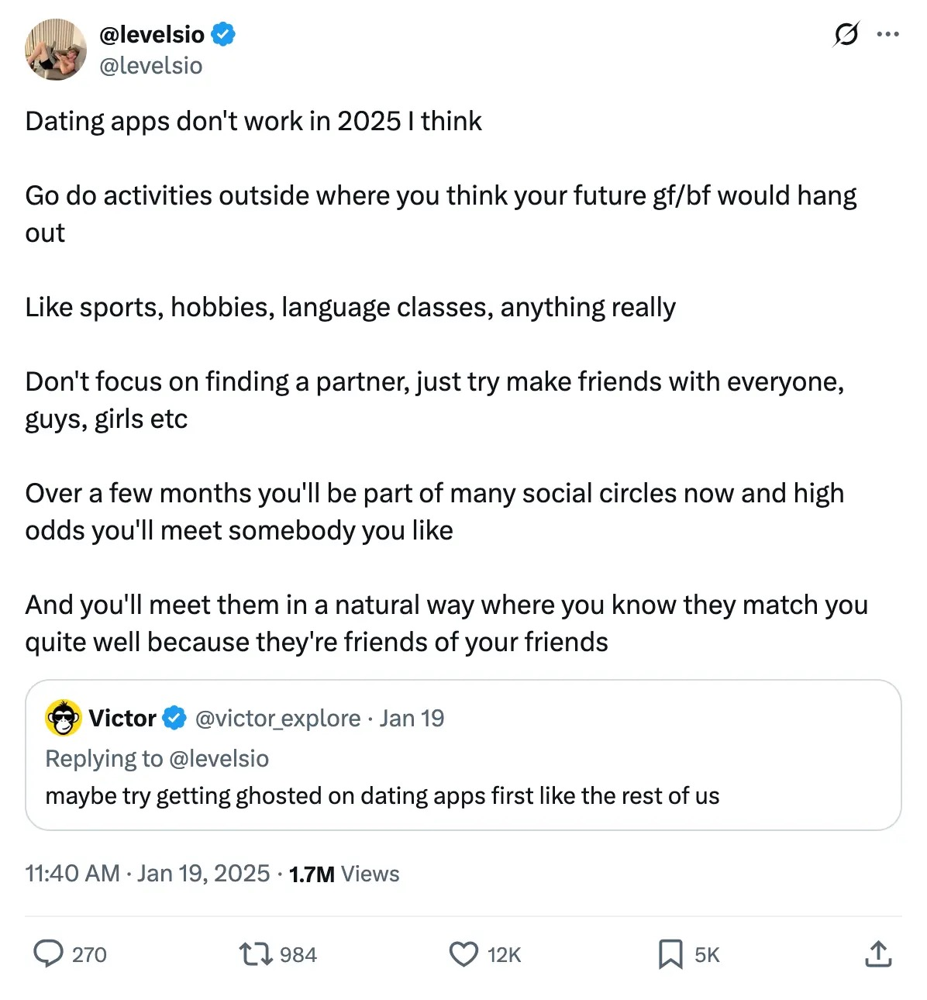
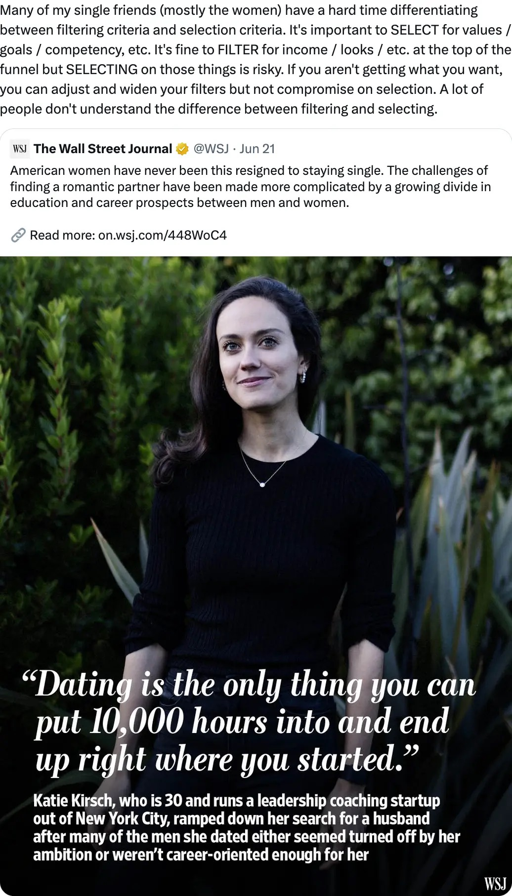
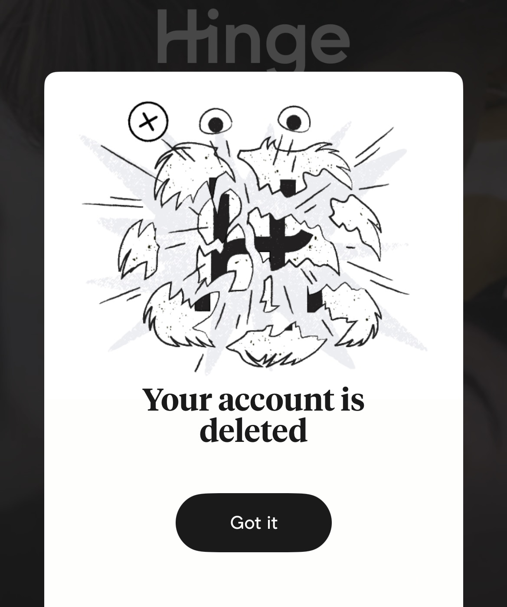
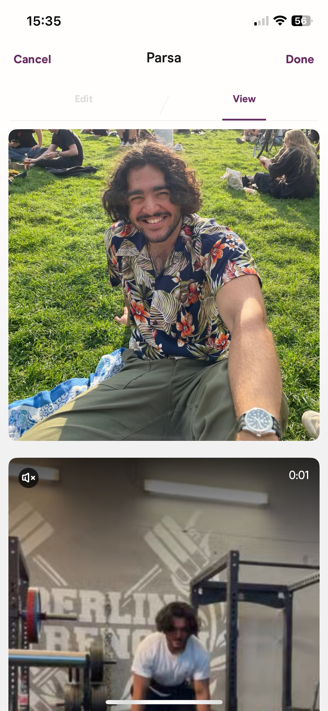
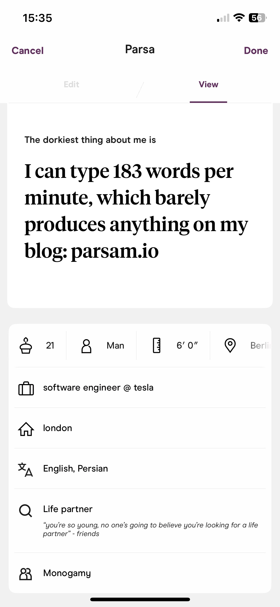
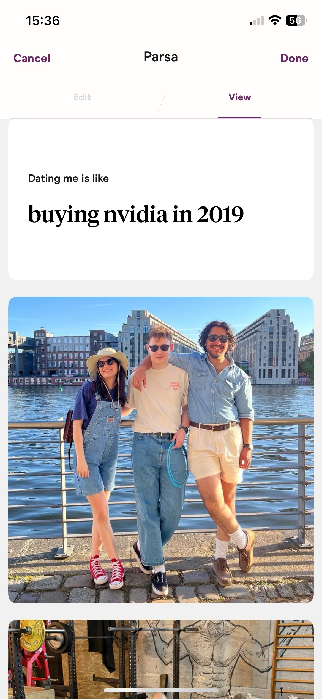
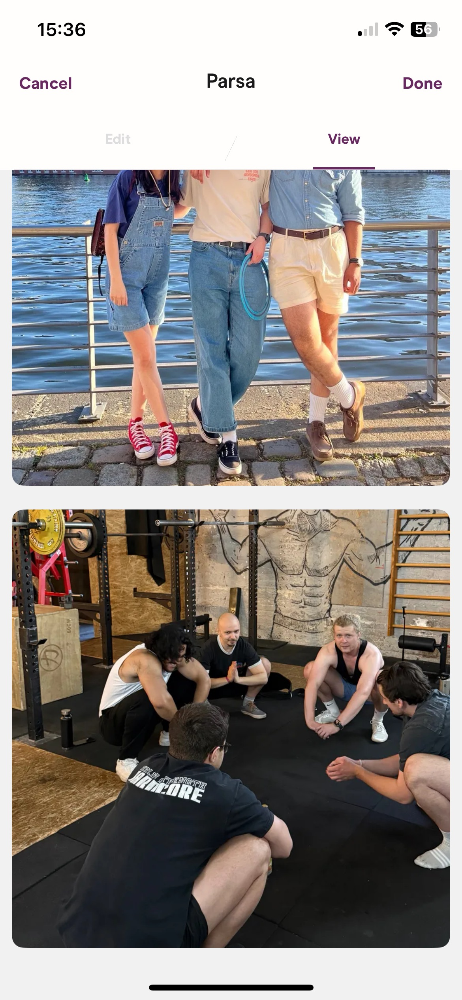

**Update (Jan 2026)**: After posting this I realised how hard it is to write about dating apps without sounding whiny or like you can't get no hoes. Most people agree that apps are genuinely shit since a lot of them don't take them seriously, but I still think I was being too rigid about them which was ignorant of me. Reading [Black Swan](https://en.wikipedia.org/wiki/The_Black_Swan:_The_Impact_of_the_Highly_Improbable) made me realise I should be exposing myself to upside risks, and the risk is worth it if something good happens. IRL is always the way to go, but ruling out apps entirely even if using them passively is dumb.

---

For the majority of my life, I had the identity of being somewhat of a purist. I didn't have my first sip of alcohol till last year, nor gone to the club till earlier this year (I live in Berlin so it was inevitable). In general I was against a lot of things that I felt did not have a meaningful impact on my life, but also because I never deemed myself cool enough to do them.

As I've gotten older (I [turned 22](https://parsam.io/22) 2 days ago), I've become more lax with these strict rules. I think having these "streaks" of not doing something was dumb. I remember telling myself "☝️🤓 I will have my first glass of alcohol with that special someone". I had my first pint with my dad, and that brought me joy more than anything in the world.

Many of my friends turn to me for advice (though I'm not sure why), and I feel like it should be a duty of mine to provide them evidence based on actual experiences. If I have no skin in the game, then I'm basing them off of what others say. This has worked well for a while, but I should start basing decisions on my own judgement.

This brings us to the topic of dating apps, a so called necessary evil that I've notoriously been against ever since I learned of the existence of them.

([link](https://x.com/levelsio/status/1880943325261295712))

([link](https://x.com/davidu/status/1937149103986651552))

# I thought it'd be a good idea

Here's the thing though, I started working at 18, and most of the people in my daily life are much older than me. So when I [moved to Berlin last year](https://parsam.io/tesla) on my own, this put me in a rather unique position for my age. I don't know a single other 22 year old besides my friend who's interning at Tesla. I'm always the youngest in the environments I’m in.

It also doesn't help that I look and behave much older than my age. Funnily enough, not a single person has guessed my age correctly, they always overestimate by at least 3 years. One guy even thought I was 30! I don't even think I look older, maybe it's because my Persian genetics in the western world makes me seem older.

I decided to install a dating app because I figured it would be a good way to help me bridge the communication with people around my age.

But before I went straight to installing, I asked around my circle of friends for their experiences of using dating apps. I have some friends from work and gym who've had success using them. Fun fact, I'm actually writing this on a train back home from Poland after attending a wedding, where the bride and groom met on a dating app.

# Downloading the app

I decided fine, I'll download Hinge since it seems like the most viable, what's the worst that could happen? I'm thankfully aware enough to know that I probably won't find my wife on them, but it would be some good exposure.

Oh man was I wrong.

It was genuinely the most depressing week of using an app. With every swipe (not really a swipe, you just click a button to say you're not interested), I could feel my brain rotting away. People actually swipe away on these apps for years without making a decent connection, yet we still wonder why we have a social anxiety problem among our generation.

From ["Generation Z and Mental Health"](https://www.aecf.org/blog/generation-z-and-mental-health):

> A [2023 Gallup sur­vey](https://www.gallup.com/analytics/506663/american-youth-research.aspx "2023 Gallup Survey") found that **almost half (47%) of Gen Zers ages 12 to 26 often or always feel anx­ious**, and more than one in five (22%) often or always feel depressed.

I also felt like such an asshole. I was seeing the flaws as opposed to the positives, because that's all thats projected to me through photos and some supposedly clever prompts.

Also, since I'm in Berlin, most profiles were written in German, and I honestly could not be bothered to translate each prompt, I ain't that thirsty. Most of the time I responded to the ones in English.

# Deleting my account

I told myself I will try it for just a week, but everyone said that's not enough for the algorithms to kick in, so I said ok I'll do 2 weeks. After the second week I was certain that these dating apps were not for me, so I deleted my account immediately. I sent enough likes/comments in the first week to know that it just wouldn't work for me no matter how long people tell me I need to keep it installed.

# My profile

Here's the profile I had before deleting my account. It went through a bunch of tweaks, and most friends said it was good. I also tried to ask some people I didn't know as well to remove the bias.

Looking back on it, I think my friends were bullshitting. My profile is quite shit, but it was definitely better than a lot of the ones I saw.

# Don't get fooled by randomness (it's all luck)

You hear about all these success stories about couples who go on to get married after meeting on a dating app. But what you don't realise is that they were on these apps in the golden era. I would say this golden era was before the pandemic.

The friends I mentioned earlier who just got married met on Tinder over 6 years ago, which was a completely different time. I think after COVID the apps declined, because people became so used to being socially isolated behind a screen.

Dudes make the joke about seeing a girl they like, having the opportunity right there to speak to them, but instead they try to find them on an app. I know it's a joke, but it's a reality for some.

I downloaded the app at a perfect time because I was absolutely immersed in [Nassim Nicholas Taleb's](https://en.wikipedia.org/wiki/Nassim_Nicholas_Taleb) book, [Fooled by Randomness](https://en.wikipedia.org/wiki/Fooled_by_Randomness). It's a remarkable book on how chance affects us in life, and how we tend to get surprised by it, despite knowing that everything is dependant on chance. This book has single-handedly changed how I perceive the world.

So I knew not to expect anything, as luck has struck me in other areas, just not in this one.

# It's based on optics

People treat these apps like it's Instagram, they just don't care about finding a life partner, they want the validation. Everyone knows they're not going to find their life partner on there, yet still participate in these status games.

When flaws are so easily projected, there's not much else to latch onto. Prompt's are still too shallow to represent a whole person.

# Zero repercussions

When you're hiding behind a screen, it's easy to feel like there's zero consequences with how you behave online.

There's no sort of reputation at stake here. If you ghost, nothing will happen.

But when you're meeting someone from your school or neighbourhood, you have a reputation at stake you need to preserve.

# Touch grass

As funny as it is, if you truly want to find your life partner, you need to be maximising your exposure in real life. Go to meetups, find your third space, find your people. Naturally the world will gift you when you're doing cool stuff. You can just do things.

The problem with these apps is that when there's no common ground, i.e meeting your spouse at the gym or some place you go to on a recurring basis, it's harder to gauge how a person is over the long term. But when you see someone on a daily basis through work or at your gym, then you grow to like each other. Your flaws suddenly become endearing.

Furthermore, at least in real life I can have some sort of control over how many girls I approach in a night out, and I would at least get a response. But on these apps you basically have to gamble with if the other person would even solicit a response.

# Closing thoughts

As for me, idk.

My friends tell me that I'm just too young to be looking for a wife. The girls my age are not in my immediate day to day vicinity, and I'm not going to force my way into that sphere. I just need to wait patiently.

I highly recommend reading [Signull's post](https://signull.substack.com/p/dating-apps-are-marketplaces-not) on the same topic.
