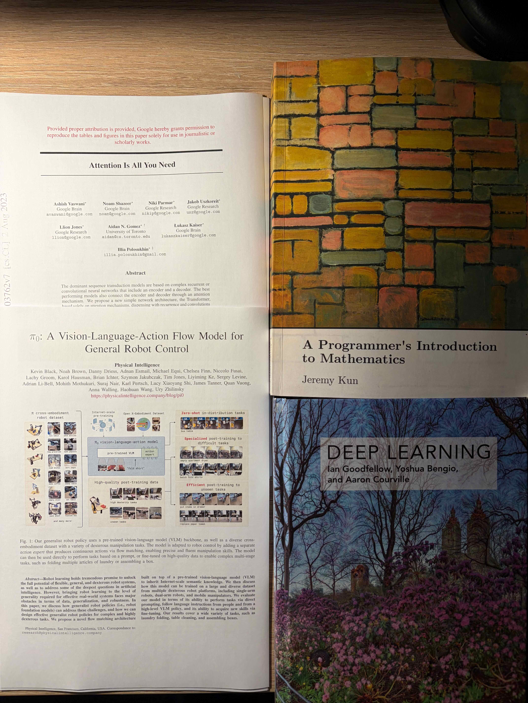
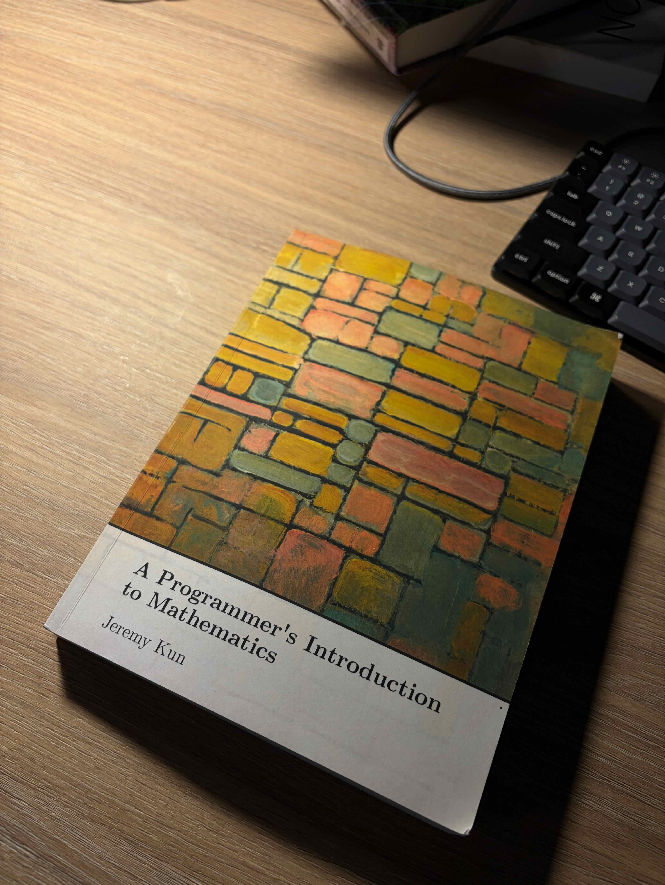
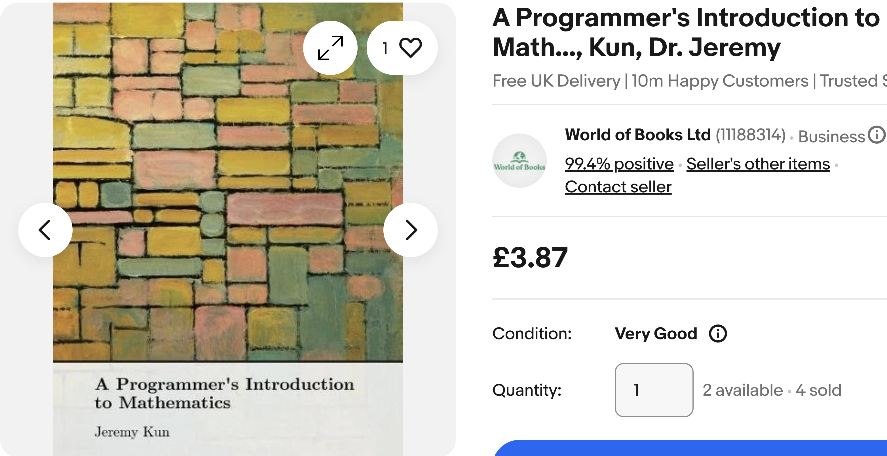
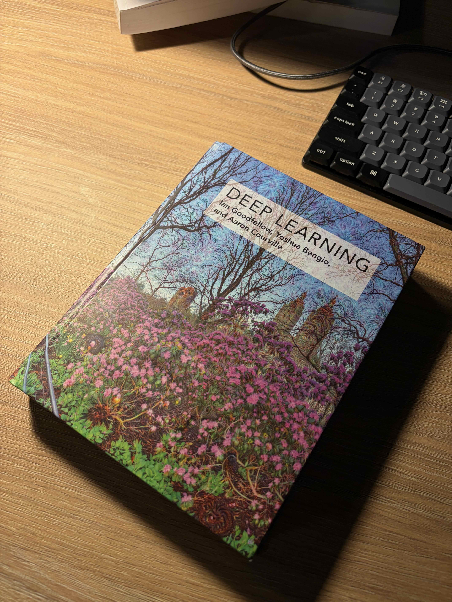
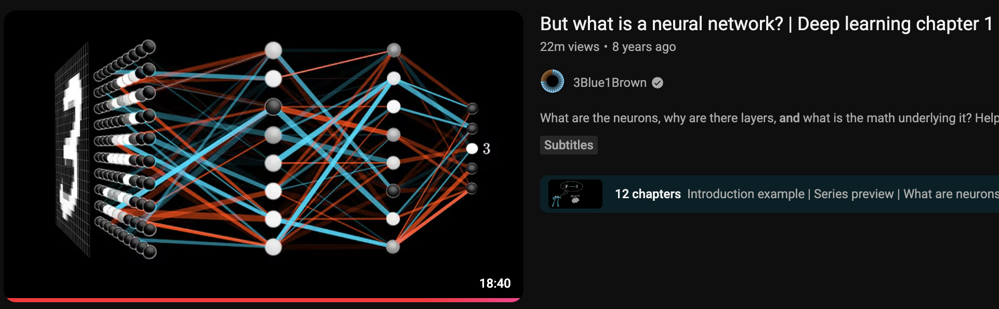
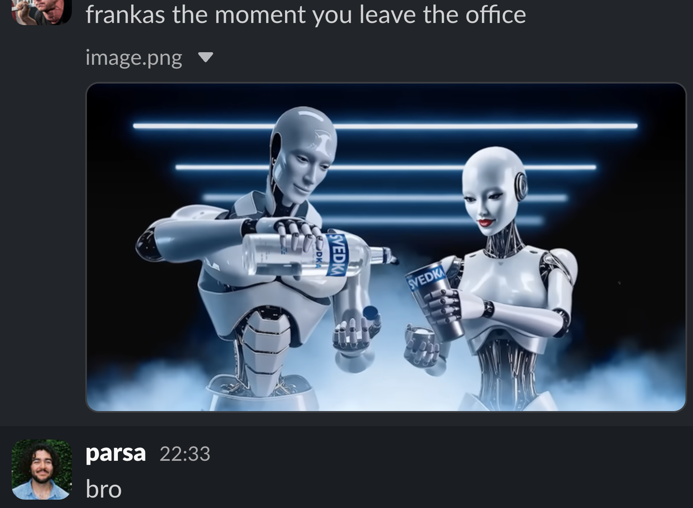

last week I shared that [I left Tesla](https://parsam.io/yaak) to pivot into AI and robotics at [Yaak AI](https://yaak.ai).

naturally, people were curious as to how I'm planning to learn these new topics, because I've never formally studied them before. most of my work as a software engineer hasn't required any formal knowledge in maths, nor knowledge in AI to use LLMs.

some background on me: I didn't go to university, started learning to program at 17, got my first job at Google at 18, then 2 years later I joined Tesla. so I would consider myself an [autodidact](https://en.wikipedia.org/wiki/Autodidacticism).

because of this new journey, I thought it'd be worth sharing the resources I'll be using to aid me.

the topics I need to study were narrowed down to:
1. Maths
2. AI and Robotics (I merged them because they overlap heavily. the papers I'm reading are from modern robotics, which is mostly ML)
# Maths

### A Programmer's Introduction to Mathematics by [Jeremy Kun](https://www.jeremykun.com/)

I came across [this book](https://pimbook.org/) while reading [Ludwig's post](https://ludwigabap.com/posts/on-the-math-books-i-am-using-to-learn-about-pure-mathematics-part-1/), and it has been phenomenal so far. if you're someone whose eyes glaze over formulas, then reconstructing them with code helps. I'm using this book as a sort of catch all for the topics I need, then if I need to go deeper I can use something like [3Blue1Brown's videos](https://www.youtube.com/@3blue1brown).

I'm going through these [chapters](https://pimbook.org/pdf/pim_toc.pdf):
- Chapter 2. Polynomials
- Chapter 4. Sets
- Chapter 6. Graphs
- Chapter 8. Calculus with One Variable
- Chapter 10. Linear Algebra
- Chapter 12. Eigenvectors and Eigenvalues
- Chapter 14. Multivariable Calculus and Optimization
- Chapter 16. Groups

you can pay as you feel [for the PDF](https://j2kun.gumroad.com/l/pim-book), but I bought a used physical copy which I think was very worth it. so have a look around on eBay or Amazon.

### Essence of [Calculus](https://www.3blue1brown.com/topics/calculus) and [Linear Algebra](https://www.3blue1brown.com/topics/linear-algebra) by 3Blue1Brown
for many years I've heard of 3b1b's videos but never had a reason to watch them until now. the animations do help with making concepts click, plus it's nice that they provide [text versions](https://www.3blue1brown.com/lessons/essence-of-calculus) to reference (I tend to lean towards reading more than watching).

these 2 resources are pretty much the only ones I'll be using for maths. I don't need to overwhelm myself, plus I'm not studying to become a mathematician, just enough to get me by.

# AI and Robotics

## Books

### [Deep Learning](https://www.deeplearningbook.org/) by Goodfellow, Bengio and Courville
my [CTO](https://www.linkedin.com/in/harsi/) gave me his physical copy, and I'm using it more as a reference book to lookup things. the book is free to read online, but I generally think having physical copies of textbooks like this are worth it.

### [Society of Mind](https://en.wikipedia.org/wiki/Society_of_Mind) by Marvin Minsky
gifted by my CTO, not relevant to my studies, but it seems relevant in the age of agents and as something miscellaneous to read.

## Videos and Courses

- [Neural Networks](https://www.3blue1brown.com/topics/neural-networks) by 3Blue1Brown - I think the [visuals](https://youtube.com/playlist?list=PLZHQObOWTQDNU6R1_67000Dx_ZCJB-3pi) (of course the url is suffixed with `pi`) are even more important in learning AI, so I'm happy with it so far
- [Neural Networks: Zero to Hero](https://youtube.com/playlist?list=PLAqhIrjkxbuWI23v9cThsA9GvCAUhRvKZ) by Andrej Karpathy
- [Neural Networks and Deep Learning](http://neuralnetworksanddeeplearning.com) by Michael Nielsen - I went through the first few chapters a couple months ago, I like how it teaches from the absolute foundations of deep learning that won't go out of fashion any time soon ([aka Lindy](https://en.wikipedia.org/wiki/Lindy_effect))
- [Practical Deep Learning](https://course.fast.ai/) by fast.ai
- [Robotic Manipulation](https://manipulation.csail.mit.edu/index.html) by MIT
- [Robotics Course](https://huggingface.co/learn/robotics-course/unit0/1) by Hugging Face

## Papers

- [Attention Is All You Need](https://arxiv.org/abs/1706.03762) - the transformer architecture that changed everything
- [An Image is Worth 16x16 Words (ViT)](https://research.google/blog/transformers-for-image-recognition-at-scale/) - transformers applied to vision
- [Denoising Diffusion Probabilistic Models](https://hojonathanho.github.io/diffusion/) - the maths behind diffusion models
- [π₀: A Vision-Language-Action Flow Model](https://www.pi.website/blog/pi0) - for one of my interviews with Yaak I had to study this paper and present it back to them. this is the first paper I ever read in my life, well written. [let me know](https://x.com/pzrsaa) if you're interested in seeing that presentation!
- [RT-2: Vision-Language-Action Models](https://robotics-transformer2.github.io/) - how vision-language models can directly output robot actions
- [Diffusion Policy](https://diffusion-policy.cs.columbia.edu/) - representing visuomotor policy as a diffusion process
- [Learning Fine-Grained Bimanual Manipulation with Low-Cost Hardware (ACT)](https://tonyzhaozh.github.io/aloha/) - action chunking with transformers, the method behind ALOHA
- [Universal Manipulation Interface](https://umi-gripper.github.io/) - portable data collection for robot learning
- [Octo: An Open-Source Generalist Robot Policy](https://octo-models.github.io/)
- [Robot Learning: A Tutorial](https://arxiv.org/abs/2510.12403) - overview of Robotics from the Hugging Face/LeRobot team

## Blogs & Articles
- [A Recipe for Training Neural Networks](https://karpathy.github.io/2019/04/25/recipe/) by Andrej Karpathy - something to read before training models
- [From Words to Worlds: Spatial Intelligence](https://drfeifei.substack.com/p/from-words-to-worlds-spatial-intelligence) by Fei-Fei Li - the field Yaak operates in
- [A Gentle Introduction to Graph Neural Networks](https://distill.pub/2021/gnn-intro/)

it might seem like a lot, but keep in mind I'm not loading all of this suddenly into my brain, it's just the general path I'm headed towards with studying

I hope it was useful! if there's anything you could suggest, do [dm me on twitter](https://x.com/pzrsaa) or [email me](mailto:hi@parsam.io).

(one of the robotic arms I work with is the [Franka FR3](https://franka.de/franka-research-3))
