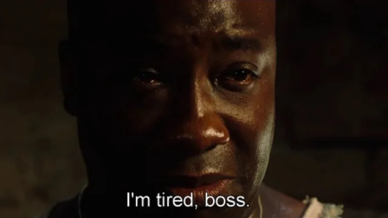
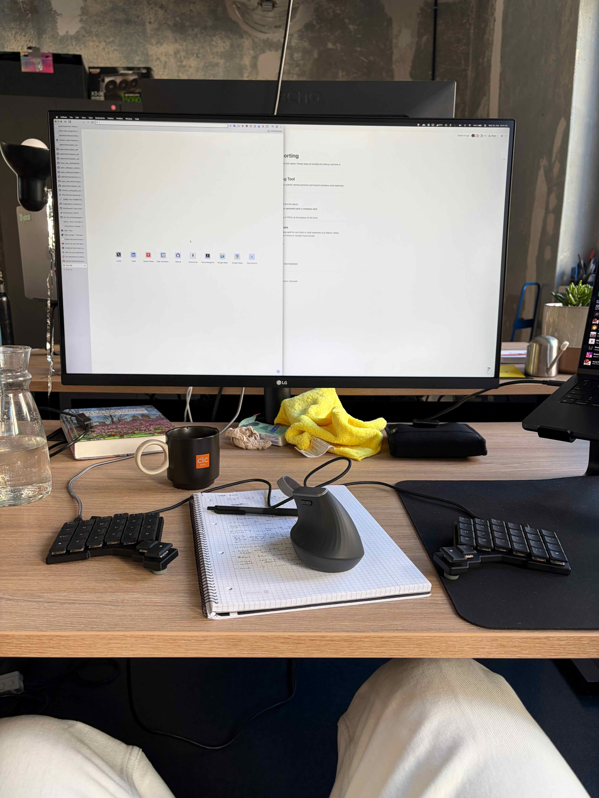

recently I stopped using my [ZSA Voyager](https://www.zsa.io/voyager), a $365 ortholinear split keyboard (I bought it second hand in new condition for €300).

all the cool kids are switching to split keyboards, swearing they'll never switch back, so why did I?

it mainly comes down to one reason, and it's that it's all [too much, man](https://en.wikipedia.org/wiki/That%27s_Too_Much,_Man!).

I already have enough efficiency boosts in my interactions with the computer. I use vim bindings, raycast, [link hints](https://lydell.github.io/LinkHints/) in my browser, [aerospace](https://github.com/nikitabobko/AeroSpace) as a window manager, I [type fast](https://monkeytype.com/profile/pzrsa), and the list goes on. I'm always looking for ways to reduce the time between thought > action > result.

but at a certain point, I started to see diminishing returns. it was just a mental strain after a while. it becomes too much technology when I'm trying to live simpler.

with a keyboard like this there's always one more thing to fix, and every time I told myself this was the last time. reminds me of my Neovim days (thankfully I use [Helix](https://helix-editor.com) and [Zed](https://zed.dev) these days).

I would often just leave it in the office because I didn't want to spend 2 minutes packing and putting it in my backpack. I'd feel a bit naked without it, but then I'd just type on the macbook keyboard (I have no problems switching) and somehow be even more productive.

you might argue that the split keyboard is not really for speed, it's for comfort. and I agree, I felt a lot more comfortable typing with my split. but I don't mind having to use a normal keyboard, as I should probably be getting off my ass and moving around anyways.

I don't have health issues that would require me to use one, just the slight mental problem that I like getting into expensive hobbies.

"your layout isn't optimal" - I mean, sure, [here you go](https://configure.zsa.io/voyager/layouts/6y7ED/KrlnVp/0). main thing is I just got tired of thinking about my keyboard.

as I'm wrapping this, I'm starting to see the resemblance to that time when TechLead said "[Linux is free if you don't value your time](https://youtu.be/Qt2GkwwypDw)", but for niche keyboards.

I switched back to my HHKB (I [recorded a review](https://youtu.be/bCd6KBqvCcg) on it a while back), and I've been happy to use a normal (more or less) keyboard again.

I genuinely enjoyed the Voyager, it felt premium. I still have the keyboard so every now and then I might come back to it. or eventually sell it.
