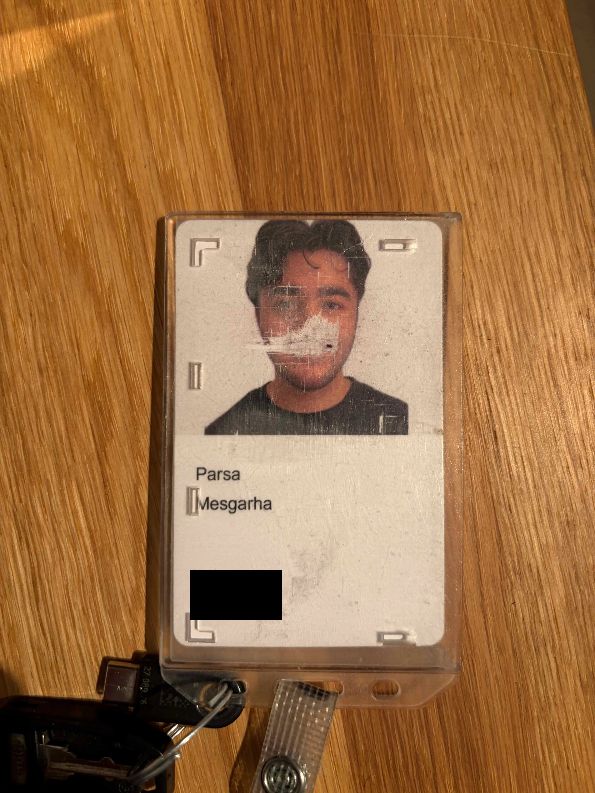
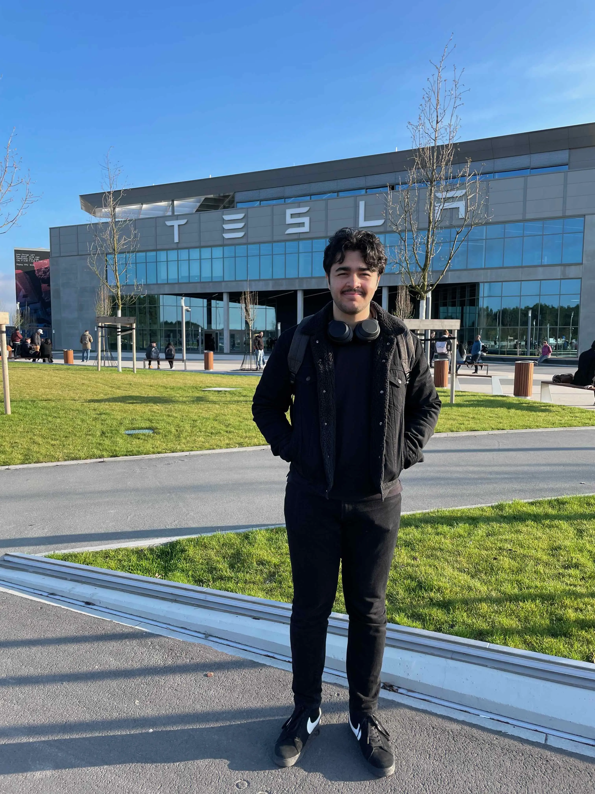
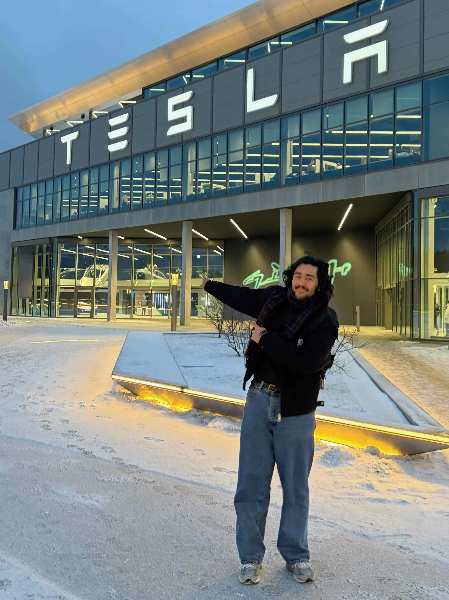
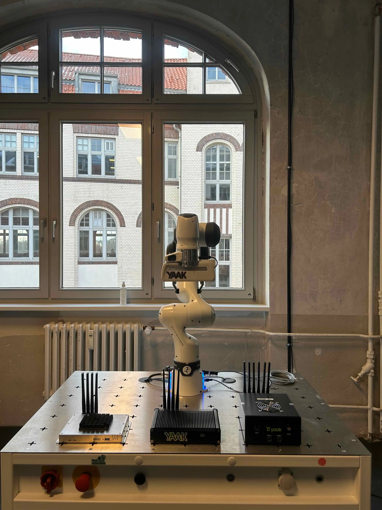

after [almost 2 years](https://parsam.io/tesla) at Tesla, I decided to part ways ~2 weeks ago (my last actual day was Jan 30).

my first day, April 2024:

I'm grateful that they allowed me to move from London to Berlin, which in itself has been one of the best decisions I made. I'm glad to have worked on a bunch of interesting problems related to scaling Gigafactories globally with the software I wrote with a team of amazing coworkers.

the scale in which Tesla operates is fascinating. before Tesla my job was at Google, and that experience taught me about scale in compute, but Tesla showed me that type of scale in the real world. given their size I also made so many friends from all walks of life at the office/factory.

with all that said it was a tough decision, but the hardest decisions have often set me up for an easier life.

my last day, yeah I look less like a child now:

I wanted to take on a new challenge, especially in the field of AI and robotics. so last week I started as an ML/robotics engineer (official title is senior machine learning engineer) at [Yaak](https://yaak.ai), an AI startup in Berlin where we're building the platform for spatial intelligence and robotics.

my job will be to get robots to understand and interact with the world around them, hopefully replacing me. I think we're at a pivotal point in robotics right now where they've gone from being brittle and domain-specific to becoming general-purpose (a la [Physical Intelligence](https://www.pi.website/)).

looking back it's quite surreal to see the progress I've made from Google -> Tesla -> Yaak and I'm still [22](https://parsam.io/22). titles are meaningless but getting to senior is still something to be proud of.

excited to see what the future holds!
