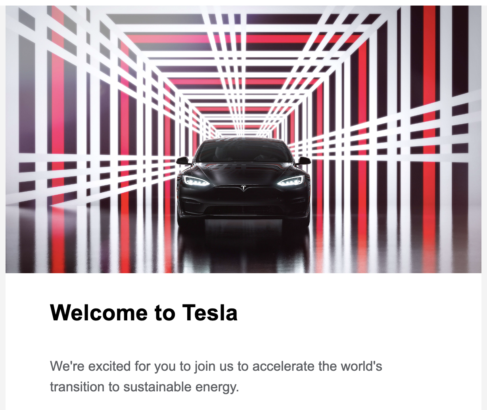

I'm pleased to share I joined Tesla! This will be a huge leap in my professional life as a Software Engineer, as well as my personal one as I've moved from London to Berlin, where I've started working from their [Gigafactory](https://www.tesla.com/en_eu/giga-berlin).

Two years ago, I got my first ever job as a Software Engineer at one of the best tech companies in the world - [Google](https://parsam.io/joined-google). I genuinely can't believe I worked there, especially alongside some fantastic people who I learned so much from. It was truly a once in a lifetime opportunity.

But all great things often come to an end :(

Back in September, my friend [Cyrus](https://twitter.com/CyrusYari) kindly referred me to Tesla. I had my interviews across October and November, then received and signed the job offer/contract in December. It also took me about 3 months to get most of the German immigration stuff sorted, and it was definitely... an experience.

Alongside the new title and compensation, I'm really excited about the fact that I'll be living independently in a new country.

I never went to university to learn the struggles of living alone (and being broke as shit). All my life I've lived with my parents, and that is such a luxury I am eternally grateful for. I need this independence to grow as a person, and become the man I want to be (cringe but true).

I'm also looking forward to learning how to properly cook some nice meals for myself and guests, cause when you're living with what I consider the best [jeffs](https://www.youtube.com/watch?v=HD59d5vJ_kk), it's kinda difficult. It's like learning a new language - if you're living in the country but most people speak for example English, it's much harder.

Here's an Italian style Omelette I made the other day:

I can't wait to see what this new endeavour holds, and I want to express my gratitude to everyone who's helped me get to where I am today. I'm fully aware I've been extremely lucky, but there's still a long road ahead.

I still vividly remember the first day I started learning how to program at the beginning of 2021 at 17, and it's ridiculous how far I've come in 3 years.
